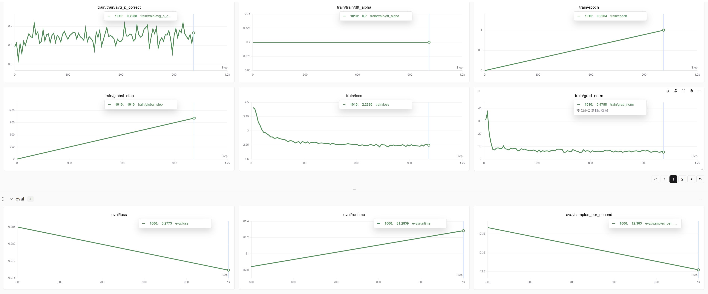

# Advanced Fine-Tuning Framework for LLMs with Differentiated Loss



## ✨ 项目特色

*   **🚀 差异化微调 (DFT) Loss**: 创新的自定义损失函数，它根据模型对正确Token的预测置信度（`p_correct`）动态调整损失权重。这使得模型能够更专注于巩固“已学好”的知识，同时避免被“过难”的样本带偏，从而实现更稳定、高效的收敛。
*   **⚡ 高性能与高效率**:
    *   **分布式训练**: 深度集成 **DeepSpeed ZeRO-3**，支持在多GPU上进行大规模模型训练，极大优化了显存占用。
    *   **Flash Attention 2**: 内置支持 `flash_attention_2`，显著提升长序列（如8K+）训练的速度和效率。
    *   **梯度检查点 (Gradient Checkpointing)**: 有效减少训练过程中的显存消耗。
    *   **BF16/FP16 混合精度**: 加速训练过程，同时保持模型性能。
*   **📦 健壮的数据处理**:
    *   **ChatML 格式**: 专为处理 `ChatML` 格式的对话数据而设计。
    *   **多源数据融合**: 能够自动加载、验证和合并来自多个不同JSON文件的训练数据，并处理schema不一致的问题。
    *   **高效预处理**: 支持多进程数据预处理，加快数据准备速度。
*   **📝 全面的日志与监控**:
    *   **分布式日志**: 内置自定义的分布式日志记录器，确保在多卡环境中日志清晰、不冗余。
    *   **训练指标监控**: 深度集成 **WandB** 或 **SwanLab** 等实验跟踪工具，实时监控`loss`、`grad_norm`以及自定义的 `avg_p_correct` 等关键指标。
*   **🔧 灵活配置**: 所有训练参数（模型、数据、DFT参数、训练参数等）均通过命令行进行配置，清晰易用。

## 🧠 DFT Loss 工作原理

DFT Loss的核心思想是：**让模型更关注它有把握学对的东西**。

传统的交叉熵损失对所有Token一视同仁。而DFT通过一个`dft_alpha`参数来调整这一行为。其核心逻辑如下：

```python
# 1. 计算模型预测正确Token的概率 p_correct
with torch.no_grad():
    probs = F.softmax(shift_logits_flat, dim=-1)
    p_correct = probs.gather(1, correct_labels.unsqueeze(-1)).squeeze(-1)

# 2. 根据 p_correct 和 dft_alpha 计算损失权重
# 当 p_correct -> 1 (模型很自信), dft_weight -> 1
# 当 p_correct -> 0 (模型不自信), dft_weight -> (1 - dft_alpha)
dft_weight = p_correct * self.dft_alpha + (1 - self.dft_alpha)

# 3. 将权重应用到原始损失上
loss_flat = original_loss_flat * dft_weight

# 4. 计算最终平均损失
loss = loss_flat.sum() / num_valid_tokens
```

通过这种方式，模型预测越不准的“困难”样本，其损失权重就越低，从而避免了这些样本产生过大的梯度来干扰模型的整体收敛进程。

## ⚙️ 环境准备

1.  克隆本仓库：
    ```bash
    git clone https://github.com/your-username/your-repo-name.git
    cd your-repo-name
    ```

2.  建议使用 `conda` 创建一个虚拟环境：
    ```bash
    conda create -n dft_trainer python=3.10
    conda activate dft_trainer
    ```

3.  安装依赖。请确保您的环境中已安装与您的CUDA版本匹配的PyTorch。
    ```bash
    # requirements.txt
    
    # 核心依赖
    torch --pre "torch>=2.1.0"
    transformers "transformers>=4.40.0"
    datasets "datasets>=2.18.0"
    deepspeed "deepspeed>=0.14.0"
    
    # 加速与效率
    accelerate "accelerate>=0.29.0"
    flash-attn --pre "flash-attn>=2.5.0" --no-build-isolation
    
    # 工具
    sentencepiece # for tokenization
    protobuf # for tokenization
    
    # 实验跟踪 (可选)
    swanlab
    wandb
    ```
    执行安装：
    ```bash
    pip install -r requirements.txt
    ```

## 📚 数据准备

本项目使用标准的 `JSONL` 文件格式，每一行是一个JSON对象。每个JSON对象必须包含一个 `messages` 字段，其内容遵循 **ChatML** 格式。

**数据格式示例 (`data.jsonl`)**:
```json
{"messages": [{"role": "system", "content": "You are a helpful assistant."}, {"role": "user", "content": "你好，请介绍一下自己。"}, {"role": "assistant", "content": "你好！我是一个大型语言模型，很高兴为您服务。"}]}
{"messages": [{"role": "user", "content": "帮我写一首关于春天的诗。"}, {"role": "assistant", "content": "当然。春风拂面绿芽新，细雨如丝润物频。田野芬芳蜂蝶舞，江山如画醉游人。"}]}
```
**关键点**:
*   `messages` 是一个列表，包含多个对话轮次。
*   每个对话轮次是一个字典，包含 `role` 和 `content`。
*   为了计算损失，`messages` 列表中**必须至少包含一个 `role` 为 `assistant` 的轮次**，因为只有 `assistant` 的回复才会被计入损失计算。

## 🚀 如何开始训练

训练通过一个启动脚本来管理，该脚本配置了所有必要的参数。

### 1. DeepSpeed 配置

项目需要一个DeepSpeed配置文件。这里提供一个适用于 **ZeRO-3** 的模板 `ds_config/zero3.json`。

```json
{
    "train_batch_size": "auto",
    "train_micro_batch_size_per_gpu": "auto",
    "gradient_accumulation_steps": "auto",
    "gradient_clipping": "auto",
    "steps_per_print": 2000,
    "wall_clock_breakdown": false,
    "bf16": {
        "enabled": true
    },
    "zero_optimization": {
        "stage": 3,
        "offload_param": {
            "device": "none"
        },
        "offload_optimizer": {
            "device": "none"
        },
        "stage3_param_persistence_threshold": "auto",
        "stage3_max_live_parameters": 1e9,
        "stage3_prefetch_bucket_size": 1e7,
        "contiguous_gradients": true,
        "overlap_comm": true
    }
}
```

### 2. 编写启动脚本

创建一个 `train.sh` 脚本来启动训练任务。

```bash
#!/bin/bash

export CUDA_VISIBLE_DEVICES=0,1,2,3,4,5,6,7
export TOKENIZERS_PARALLELISM=false

# 训练数据文件列表
DATA_FILES=(
    "/path/to/your/data_part1.json"
    "/path/to/your/data_part2.json"
    # ... more data files
)

# 输出和日志目录
OUTPUT_DIR="output_model"
LOG_DIR="logs"
mkdir -p ${LOG_DIR}
LOG_FILE="${LOG_DIR}/train_$(date +%F_%H%M%S).log"

deepspeed --num_gpus=8 train_dft_fixed.py \
    --model_name_or_path /path/to/your/base_model \
    --torch_dtype bfloat16 \
    --attn_implementation flash_attention_2 \
    --trust_remote_code True \
    --data_files "${DATA_FILES[@]}" \
    --max_length 8192 \
    --preprocessing_num_workers 8 \
    --validation_split_percentage 2.0 \
    --enable_gradient_checkpointing True \
    --dft_alpha 0.7 \
    --bf16 True \
    --num_train_epochs 1 \
    --per_device_train_batch_size 1 \
    --per_device_eval_batch_size 1 \
    --learning_rate 2e-6 \
    --lr_scheduler_type cosine \
    --weight_decay 0.01 \
    --gradient_accumulation_steps 16 \
    --eval_strategy steps \
    --eval_steps 200 \
    --save_strategy steps \
    --save_steps 200 \
    --save_total_limit 3 \
    --save_only_model True \
    --report_to swanlab \
    --logging_steps 10 \
    --warmup_ratio 0.05 \
    --deepspeed ./ds_config/zero3.json \
    --output_dir ${OUTPUT_DIR} \
    --logging_dir ${LOG_DIR} \
    --remove_unused_columns False \
    --ddp_find_unused_parameters False

echo "Training started in background. Log file: ${LOG_FILE}"
```

### 3. 运行训练

将脚本设置为可执行并运行：

```bash
chmod +x train.sh
nohup ./train.sh > ${LOG_FILE} 2>&1 &
```

您可以通过以下命令实时查看日志：
```bash
tail -f ${LOG_FILE}
```

## 📈 监控与结果

*   **命令行日志**: 训练进度、loss等信息会实时输出到您指定的日志文件中。
*   **实验跟踪平台**: 如果您配置了 `report_to` 为 `swanlab` 或 `wandb`，您可以访问对应的平台UI，查看所有指标的图表化展示，包括：
    *   `train/loss`: 训练集损失，应稳步下降。
    *   `eval/loss`: 验证集损失，是衡量模型泛化能力的关键。
    *   `train/grad_norm`: 梯度范数，用于判断训练稳定性。
    *   `train/train/avg_p_correct`: **DFT核心指标**，反映模型对正确Token的平均预测概率，应稳步上升。
    *   `train/train/dft_alpha`: 您设置的超参数，用于验证配置是否生效。

## 🤝 贡献

欢迎对本项目进行贡献！如果您有任何想法、建议或发现了bug，请随时提交 Pull Request 或创建 Issue。

## 📄 许可证

本项目采用 [Apache 2.0 License](LICENSE) 开源许可证。
